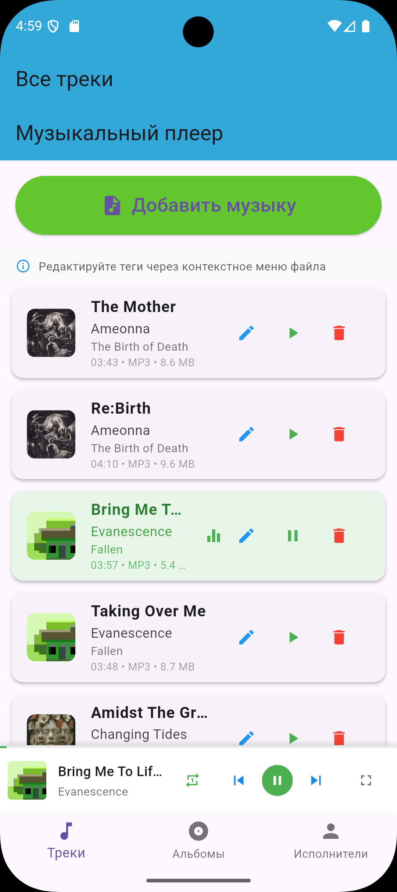
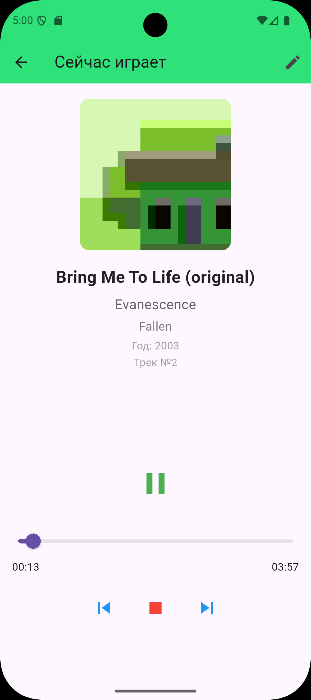
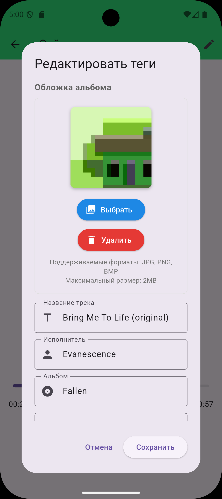
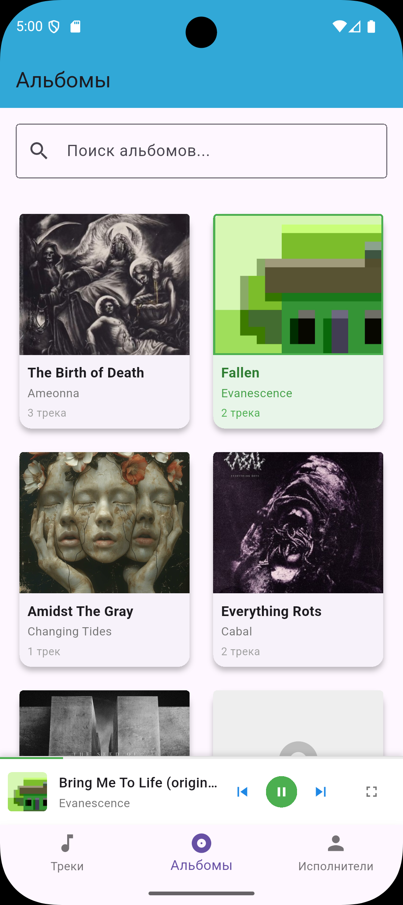
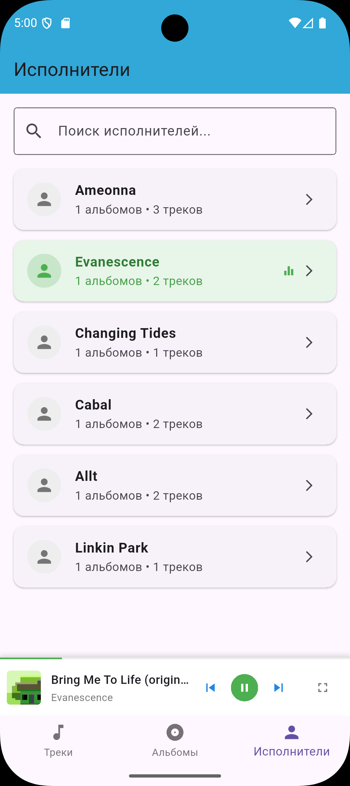

# Музыкальный плеер с редактированием тегов

## О приложении

Простой и удобный оффлайн аудиоплеер для Android с поддержкой редактирования тегов аудиофайлов. Приложение позволяет загружать треки, прослушивать и редактировать их метаданные. В приложении имеются страницы просмотра альбомы и исполнителей загруженных треков.

### Основные возможности

- **Редактирование тегов** &mdash; изменение названия, исполнителя, альбома, года, жанра, обложки
- **Проигрывание музыки** &mdash; воспроизведение треков с с мини-плеером и полноэкранным режимом
- **Быстрый поиск** &mdash; поиск по исполнителям, альбомам на странице альбомов и исполнителей

## Содержание

1. [Первые шаги](quick_start/first-steps.md)
2. [Основные функции](features/features.md)
5. [Конфиденциальность](confidentiality.md)
7. [Решение проблем](troubleshooting.md)

## Скриншоты

  <table>
    <tr>
      <td></td>
      <td></td>
      <td></td>
      <td></td>
      <td></td>
    </tr>
  </table>

## Используемые технологии

- **Flutter** &mdash; фреймворк разработки
- **Dart** &mdash; язык программирования
- **SQLite** &mdash; локальная база данных

Полезные ссылки:
- [Документация Flutter](https://docs.flutter.dev/)
- [Документация языка Dart](https://dart.dev/docs)

